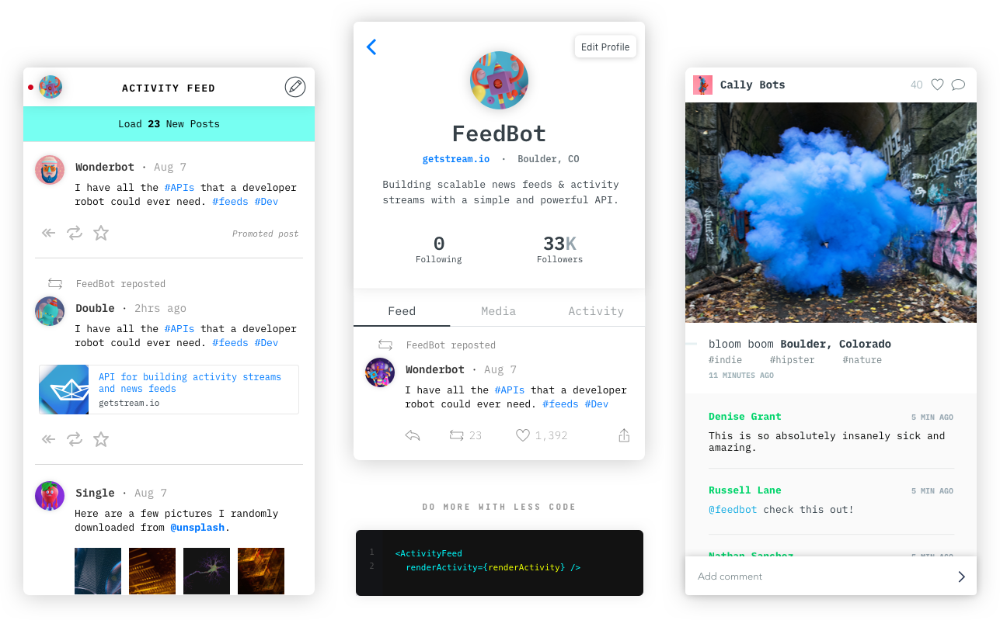

# Stream React Native Activity Feed Components

[](https://www.npmjs.com/package/react-native-activity-feed)
[](https://travis-ci.org/GetStream/react-native-activity-feed)



The official React Native integration library for Stream, a web service for building scalable newsfeeds and activity streams.

## TL;DR built-in components for social networks and regular apps

- Flat feeds
- Timelines and Newsfeeds
- Notification feed
- Likes
- Comments
- Activity detail view
- Realtime notifications

## Useful links

[Get Started](https://getstream.io/react-native-activity-feed/tutorial/)

[Example app](https://github.com/GetStream/react-native-example)

[Component reference docs](https://getstream.github.io/react-native-activity-feed/)

## Installation

The components provided by this package are available for apps built with Expo
(created with `create-react-native-app`), but also for apps with native code
(created with `react-native init`). You should install the package that matches
your situation:

```bash
# For Expo apps
npm i expo-activity-feed --save

# For apps with native code
npm i react-native-activity-feed --save
```

Both packages export the same components (which they re-export from the
underlying `react-native-activity-feed-core` package).

### Final setup steps for the `react-native-activity-feed` package

If you use the package for apps with native code you need to do some more steps
to get the image upload functionality working. If you don't need that feel free
to skip these steps.

1. Run the following command:

```bash
react-native link react-native-image-picker
```

2.
Add the following permissions to `android/app/src/main/AndroidManifest.xml`:

```xml
<uses-permission android:name="android.permission.CAMERA" />
<uses-permission android:name="android.permission.WRITE_EXTERNAL_STORAGE"/>
```

3.
Add the following key/value pairs to `ios/{app-name-here}/Info.plist`:

```xml
	<key>NSPhotoLibraryUsageDescription</key>
	<string>$(PRODUCT_NAME) would like access to your photo gallery</string>
	<key>NSCameraUsageDescription</key>
	<string>$(PRODUCT_NAME) would like to use your camera</string>
	<key>NSPhotoLibraryAddUsageDescription</key>
	<string>$(PRODUCT_NAME) would like to save photos to your photo gallery</string>
	<key>NSMicrophoneUsageDescription</key>
	<string>$(PRODUCT_NAME) would like to your microphone (for videos)</string>
```

4. Make sure that the gradle version inside `android/build.gradle` is 2.2.0 or
   higher:

```
buildscript {
    // ....
    dependencies {
        classpath 'com.android.tools.build:gradle:2.3.3'
    }
}
```

## Usage & Activity Feed setup

### Setup StreamApp component

In order to use Stream React Components in your application, you first need to initialize the `StreamApp` component. `StreamApp` holds your application config and acts as a service/data provider.

```jsx
<StreamApp
  apiKey="{API_KEY}"
  appId="{APP_ID}"
  userId="{USER_ID}"
  token="{TOKEN}"
  analyticsToken="{ANALYTICS_TOKEN}"
>
  {/* everything from your application interacting with Stream should be nested here */}
</StreamApp>
```

1. **API_KEY** your Stream application API_KEY
2. **API_ID** your Stream application ID
3. **USER_ID** current user's ID
4. **TOKEN** the authentication token for current user
5. **ANALYTICS_TOKEN** [optional] the Analytics auth token

You can find your `API_KEY` and `APP_ID` on Stream's dashboard.

#### Generating user token

The authentication user token cannot be generated client-side (that would require sharing your API secret). You should provision a user token as part of the sign-up / login flow to your application from your backend.

```js
const client = stream.connect(
  API_KEY,
  API_SECRET,
);
const userToken = client.createUserToken(userId);
console.log(userToken);
```

#### Generating analytics token

React components have analytics instrumentation built-in, this simplifies the integration with Stream. In order to enable analytics tracking, you need to initialize `StreamApp` with a valid analytics token. You can generate this server-side as well.

```js
const client = stream.connect(
  API_KEY,
  API_SECRET,
);
const analyticsToken = client.getAnalyticsToken();
console.log(analyticsToken);
```

## Copyright and License Information

Copyright (c) 2015-2019 Stream.io Inc, and individual contributors. All rights reserved.

See the file "LICENSE" for information on the history of this software, terms & conditions for usage, and a DISCLAIMER OF ALL WARRANTIES.
